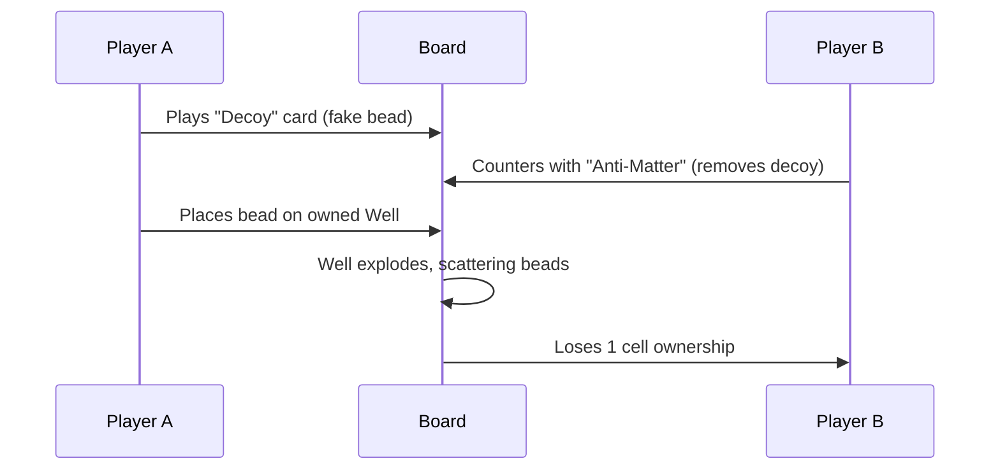

# Dakon Clash: Game Design Document (v1.1)

## Overview
**Dakon Clash** is a competitive 2-player strategy game centered around **controlled territory ownership**, **limited-use power cards**, and **predictable-but-deep counterplay**. Players compete to dominate a 7×7 board through explosive chain reactions while managing transparent card resources to disrupt opponents. The game emphasizes strategic planning, area control, and tactical use of structures and cards to outmaneuver the opponent.

---

## Core Mechanics

### **Bead Placement & Cell Ownership**
- **Owned Cells**:  
  A cell becomes owned by a player if their beads explode and spread into the cell.  
  - Players can **only place beads** on cells they own or neutral structures.  
  - Ownership resets if beads drop below 50% (e.g., due to explosions).  

- **Neutral Structures**:  
  Players can compete to claim neutral structures (e.g., Wells, Fuses) by contributing beads to them.  

### **Explosions & Chain Reactions**
- **Explosion Trigger**: A cell explodes when it reaches 4 beads, scattering 1 bead in each of the four cardinal directions.  
- **Chain Reactions**: Explosions can trigger adjacent cells, creating cascading effects.  

### **Structures**
1. **Wells**:  
   - **Passive Effect**: Absorb beads from explosions.  
   - **Claiming**: A well becomes owned by a player if they contribute 4 beads to it.  
   - **Explosion**: When a well reaches 6 beads, it explodes, scattering beads in all four directions.  

2. **Fuses**:  
   - **Timer**: Explodes after 3 turns.  
   - **Risk**: The last player to add a bead to a fuse loses 1 owned cell when it explodes.  

3. **Walls**:  
   - **Function**: Block explosions and bead movement in their direction.  
   - **Durability**: Destroyed after 3 adjacent explosions.  

4. **Mirrors**:  
   - **Function**: Redirect explosions 90 degrees.  
   - **Ownership Bonus**: Owned mirrors redirect explosions toward opponents.  

---

## Card System (Transparent Strategy)
- **Public Deck**: Both players see all available cards (no randomness).  
- **Card Types**:  
  | Card         | Use Limit | Effect                                  | Counterplay                          |
  |--------------|-----------|-----------------------------------------|--------------------------------------|
  | Anti-Matter  | 2/game    | Remove 2 beads from target cell         | Block by overloading adjacent cells  |
  | Black Hole    | 1/game    | Create a neutral Black Hole structure   | Destroy with 3 explosions            |
  | Decoy        | 3/game    | Place fake bead (triggers explosions)   | Ignore or defuse with Anti-Matter    |
  | Reinforce    | 2/game    | Add +1 durability to owned structure    | Destroy structure before reinforcement |

- **Earning Cards**: Gain 1 card after triggering a **3+ chain reaction** or **claiming 2 structures**.

---

## Win Conditions
| Condition     | Requirement                          | Notes                               |
|---------------|--------------------------------------|-------------------------------------|
| **Domination**| Own 60% of cells + structures        | Primary win condition               |
| **Overload**  | Destroy 4+ opponent structures       | Counts Walls/Mirrors/Wells          |
| **Chain Master** | Trigger 2 separate 5+ chains      | Hard but unstoppable                |

---

## Turn Structure
1. **Card Phase**:  
   - Play 0–1 card (publicly visible). Resolve effects immediately.  
2. **Place Phase**:  
   - Place 1 bead on owned/neutral cell.  
3. **Explosion Phase**:  
   - Resolve chain reactions. Update ownership.  
4. **Decay Phase**:  
   - Structures lose 1 bead if unmodified this turn.  

---

## Balancing Philosophy
- **Owned Cells**: Encourages long-term area control but limits early-game snowballing.  
- **Cards**: High risk/reward with public info to enable bluffing (e.g., baiting Anti-Matter early).  
- **Structures**: Lower ownership thresholds to incentivize conflict over key zones.  

---

## Visual & UI Priorities
- **Ownership Glow**: Owned cells pulse in player color (red/blue).  
- **Card Tracker**: Sidebar shows remaining cards for both players.  
- **Explosion Preview**: Ghost effect shows potential chain paths before placing beads.  

---

## Playtesting Goals
1. Test if **card limits** feel restrictive or strategic.  
2. Verify if **60% Domination** is achievable without stalemates.  
3. Ensure **Anti-Matter** doesn’t negate late-game chains.  

---

## Risk Analysis
- **Problem**: Players might overly focus on cards instead of beads.  
  **Solution**: Restrict cards to 1/turn and tie them to in-game milestones.  
- **Problem**: Ownership could feel "sticky."  
  **Solution**: Decay resets cells faster (lose 1 bead/turn if unmodified).  

---

## Next Steps
1. Prototype the card system and ownership decay.  
2. Refine card costs or add more counterplay triggers.  
3. Playtest extensively to ensure balanced and engaging gameplay.  

---

**Dakon Clash** v1.1 is designed to be a deep, strategic game with minimal randomness and maximum player agency. By focusing on area control, transparent card play, and dynamic structures, the game offers a fresh take on competitive strategy games. Let’s refine and playtest to make it even better! 🔥